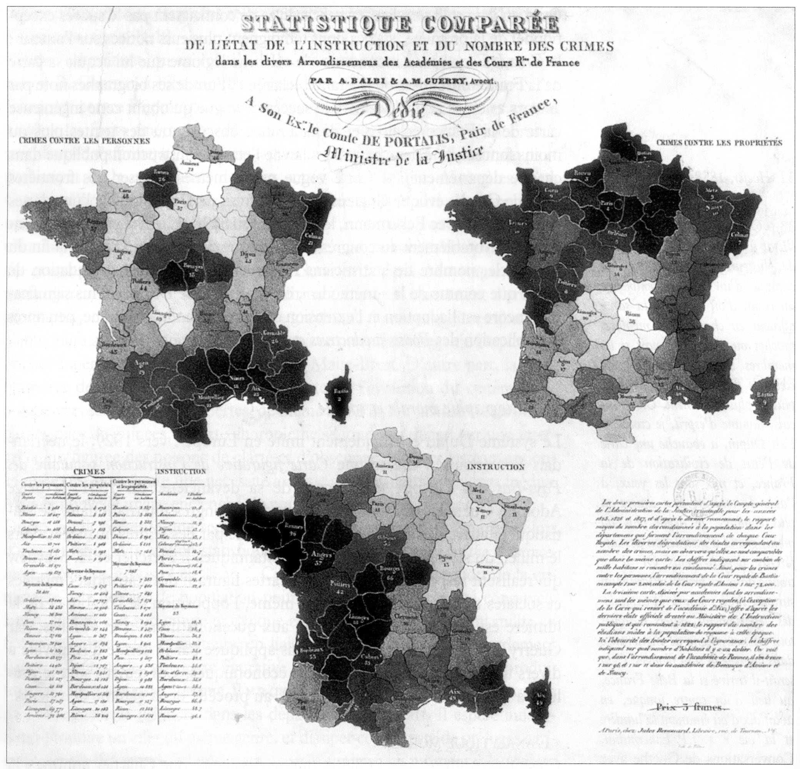
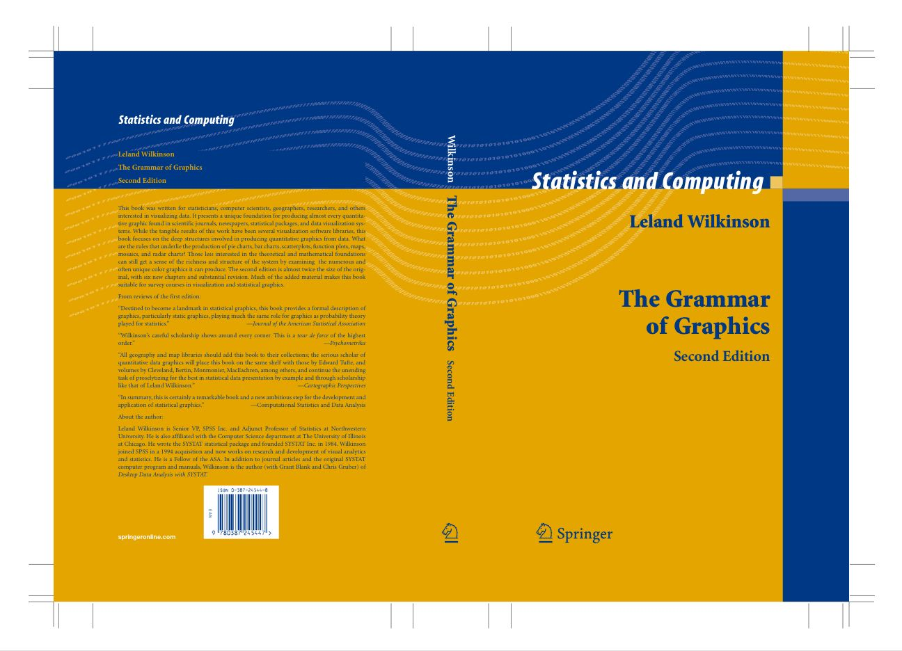


library(readr)
library(ggplot2)
library(dplyr)
library(viridis)


## A Brief History of Statistical Graphics

### Early History

When most people think about statistical graphics, they
assume I am either talking about the purely aesthetic
properties of creating visual representations of data or
a list of specific types of plots (i.e., histograms,
box plots, bar plots). The history of the latter case,
essentially akin to graphic design in general, dates
can be traced back to as early as the 6th century B.C.E.
with the earliest known maps:

The golden age of beautiful, hand-drawn graphics more
closely resembling those of today was centred around
19th Century France. Charles Minard's (1781-1870)
visualization of Napoleon's defeat in Russia is perhaps
the most well-known example of work from this period:

Personally, I am partial to the work of André-Michel Guerry
(1802 - 1866), who made amazingly modern visual arguments
from French census data.

In the 20th Century, this tradition has been carried on
with a plethora of hand designed infographics scattered
across the web and in print media such as this example
on Randall Munroe's *xkcd* web-comic:

Edward Tufte is likely the most well-known modern figure
in data-based graphical design. He has written a number
of influential books such as *The Visual Display of
Quantitative Information* (1983), *Envisioning Information*
(1990) and *Visual Explanations: Images and Quantities,
Evidence and Narrative* (1997).

I have all of his (stunningly beautiful) books in my office
if you would ever like to thumb through them.

### Theorizing Graphics

Making visually pleasing graphics is important. Our focus
today, however, is on understanding and theorizing exactly
how graphics encode knowledge about data. The history of
this begins, at least to me, with the work of Jacques Bertin
(1918-2010), a cartographer and philosopher by training.
In his 1967 work *Semiologie Graphique* he argued that:

> Graphic representation constitutes one of the basic sign-systems
> conceived by the human mind for the purposes of storing, understanding,
> and communicating essential information. As a "language" for the eye,
> graphics benefits from the ubiquitous properties of visual perception.
> As a monosemic system, it forms the rational part of the world of images.

To the best of my knowledge, this is the earliest explicit
description of graphics as a form of knowledge and evidence.
Bertin's work was republished in English in 1983 as
*Semiology of graphics: diagrams, networks, maps*:

With the translation, Bertin quickly became known by scholars
of statistical graphics. Bill Cleveland, in *Visualizing Data*
(1985), built on Bertin’s work by theorizing a distinction between
graphing, the process of visualizing  raw data, and fitting,
the process of visualizing transformed data and statistical models.

His parallel text, *The Elements of Graphing* (1993),described an
actual system to implement many of his ideas.

In *The Grammar of Graphics* (1999), Wilkinson extended
Cleveland’s theory by drawing a distinction between the
mathematical abstraction of a graph and the physical
manifestation of a rendered graphic. He then set out
to describe the fundamental units that comprised a
visualization.

Wilkinson constructed a formal language for describing
statistical visualizations by separating out the
mathematical specification of a graphics system from
the aesthetic details of its assembly and display.
Wilkinson named each component of the visualization,
moving from the original data to the output, a layer
in his formal Grammar of Graphics system.

Examples of layers include:

- picking the scale of the plot
- choosing the size of points
- computing summary statistics

Wilkinson’s formal language explicates what assumptions
are being made, where these assumptions are being
made, and how the original data has been modified to
create the output.

Finally, Hadley Wickham implemented and described a
graphical system built on the ideas of Wilkinson in
*ggplot2: Elegant Graphics for Data Analysis* (2009).
His object-oriented system, the **ggplot2** R library,
constructs rules for fitting together a small number
of classes and relationships between them to create an
"almost unlimited world of graphical forms". It is the
usage of this package that we now turn to.

## Graphics in R: ggplot2

