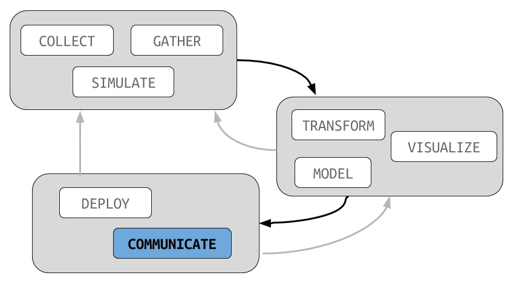


library(readr)
library(ggplot2)
library(dplyr)
library(viridis)


## argument types

There are two basic approaches to making logical arguments,
both of which have a place in making arguments from data.
These are:

- **deductive reasoning**
- **inductive reasoning**

I find that while most students have heard of these distinctions,
rarely can they concisely describe them. As each requires a
fairly distinct rhetorical approach, let's cover these briefly.

## deductive reasoning

In deductive reasoning we start with general assumptions and
show that certain conclusions logically follow from them. A
classic example is:

> Socrates is a man. All men are mortal. Therefore, Socrates is
> mortal.

If the assumptions of this statement (first two sentences) are
true, the conclusions **must** be true.

## deductive reasoning - statistics

Deductive reasoning occurs in statistics when some of our
facts (assumptions) are derived from an analysis of a dataset.
Generally this occurs when we are drawing data from a **population**.

For example, say we are looking at election results from every
county in the United States. The following is a deductive argument:

> A presidential candidate that has more than 270 electoral votes
> wins the election (assumption). Candidate A had 300 elector votes
> in 2020 (assumption derived from data). Therefore, candidate A
> won the election.

Notice that often not **all** facts are derived from data, but
importantly some are.

## inductive reasoning

Inductive reasoning, in contrast, builds a conclusion by inferring
based on patterns seen in particular examples. For instance:

> I have taught a total of 700 students over the past 5 years. I
> enjoyed teaching all 700 of them. Therefore, I enjoy teaching all
> students.

While the data provides strong evidence for the conclusion, it does
not guarantee its validity even if the assumption and logic is
infallible.

## inductive reasoning - statistics

Inductive reasoning usually occurs in statistics when sampling from
a larger population or observing a random process. For example:

> Only 1 of the 1000 patients injected with the vaccine had serious
> side-effects. Therefore, the vaccine is safe for distribution.

While inductive reasoning is more traditionally associated with
statistics, the deductive case is quite common in both industry
and academia.

## hybrid approach in statistics

Often, in an analysis of data I have observed a hybrid approach.
Namely, deductive reasoning is used to draw concrete conclusions
from data. These conclusions are then used as part of a larger
inductive reasoning.

For example, assume that you are a statistician working for a large
company and analyzing financial data. Using the data, you may
confirm that the company has increased year-over-year profits by
232% (by deductive reasoning). From this evidence, the company
decided to proceed with an IPO (by inductive).

