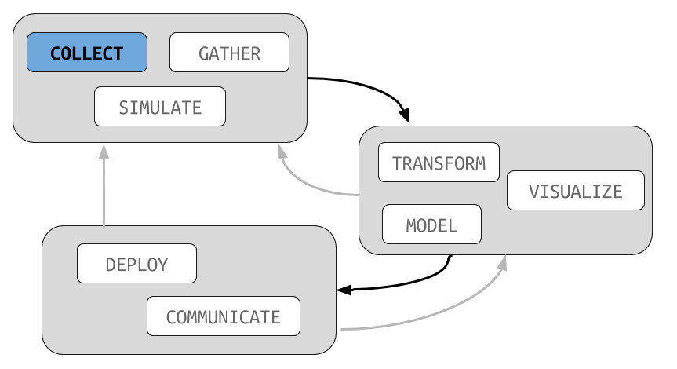


library(readr)
library(ggplot2)
library(dplyr)
library(viridis)


## Goal

We are going to start today by having you all open either
excel, open office, Google sheets, or the spreadsheet editor
of your choice.

You will be constructing a dataset representing your ten
favorite films.

Please collect the following (I suggest starting with Wikipedia
and going to IMDb and rotten tomatoes for the rest):

- name of the movie
- movie budget
- country of origin
- date first released
- staring actors (truncate to top 3 if too many)
- birthplace of each actor
- rotten tomatoes rating of the movie

Once you are done with this, export the file as a CSV to your
computer and read this into R using the `read_csv` function.
If you have time remaining before we come back together as
a group, try to construct some interesting plots.

# Data Collection

## Three principles

All of the principles of constructing a dataset (equivalently, a
database) could easily fill a whole course. Here are three principles
that get us on the right track:

- determine the objects of study; each of these gets its own table,
and each example gets its own row; **movies**, **actors**,
**actor-movie links**
- each column should be indivisible and the variable type clear;
for example, budget should not include the dollar sign, if needed
create a new column; name columns with no spaces or special characters
- always have internal consistency (0.62 or 62 percent; missing
values always "NA"); strive for external consistency (ISO country
codes)

If you would like to know about specifics of these principals I highly
recommend the Hadley Wickhams "Tidy Data" paper:

- ["Tidy Data" (2014)](http://vita.had.co.nz/papers/tidy-data.html)

The Tidy Data chapter of R for Data Science covers several useful
functions the show to convert a dataset that has already been collected
into a tidy format:

- [Tidy Data R4DS](http://r4ds.had.co.nz/tidy-data.html)

While I love the principles of Tidy Data, and find great value in the
**dplyr** and **ggplot2** packages, I personally do not think the
**tidyr** package (documented in the R4DS chapter) are particularly
helpful. Eventually you'll find something that needs to be handled
outside of those specific tools so it is just better to learn how to
clean data using base-R or **stringi** functions.

In our next class we will see how to link together the multiple
tables that we have just built.

